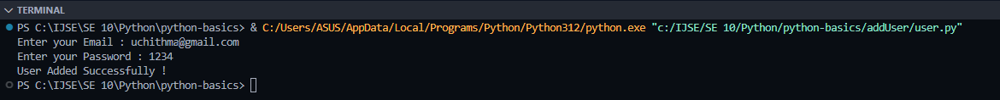

<h2>Python Basics </h2>

<h4>This project is designed to help grasp the fundamentals of Python programming.
It includes beginner-friendly examples, exercises, and explanations of key Python concepts. </h4>

<h3>OverView (main.py)</h3>

<ul style="font-size: 14px">
<li> Variables and Data Types </li>
<li> Control Flow (if/else, loops) </li>
<li> Functions </li>
<li> Arrays </li>
</ul>

<h3>Add User to Database Using Scanner (addUser)</h3>

<h4>results :  </h4>

<h4>Source Documents</h4>

<a href="https://www.w3schools.com/python/python_user_input.asp">Get User Input</a> 
<a href="https://www.w3schools.com/python/python_classes.asp">Create Classes and Objects</a> 
<a href="https://www.w3schools.com/python/python_functions.asp">Functions</a>

save database

<a href="https://www.w3schools.com/python/python_mysql_getstarted.asp">get start</a>
 
<a href="https://www.w3schools.com/python/python_mysql_create_db.asp">create database</a>
 
<a href="https://www.w3schools.com/python/python_mysql_create_table.asp">create table</a>
 
<a href="https://www.w3schools.com/python/python_mysql_insert.asp">insert data into table</a>
